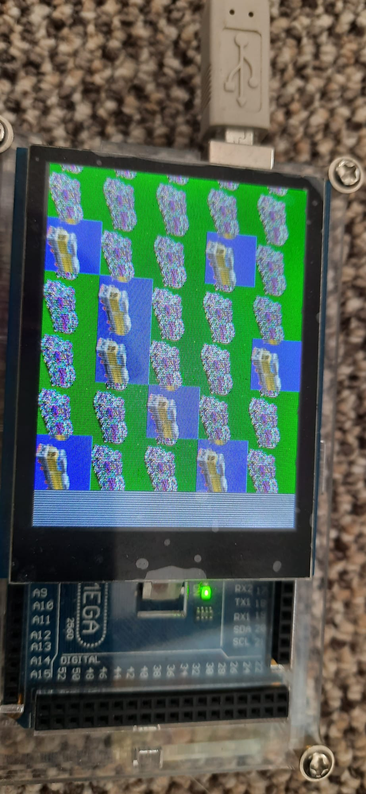

# SD Card Explorer

 

## Parts:
* Arduino MEGA 2560
* A [2.8'' TFT LCD shield w/Cap Touch and microSD](https://www.adafruit.com/product/1947)
(anything that works with ILI9341 should work)
* A microSD

## Setup:
1. Make sure your microSD has pictures to display
1. Attach the TFT to the top of the arduino
1. Change your settings in image_old.ino
    * `BRIGHTNESS`: 0-255 for the backlight strength
    * `SD_CS`: if the SD card is connected to a different port
    * `String toLoad`: the url of the image to try to display
1. Upload the sketch
1. See the images
